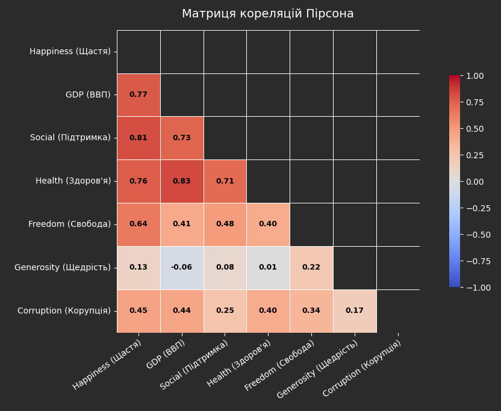
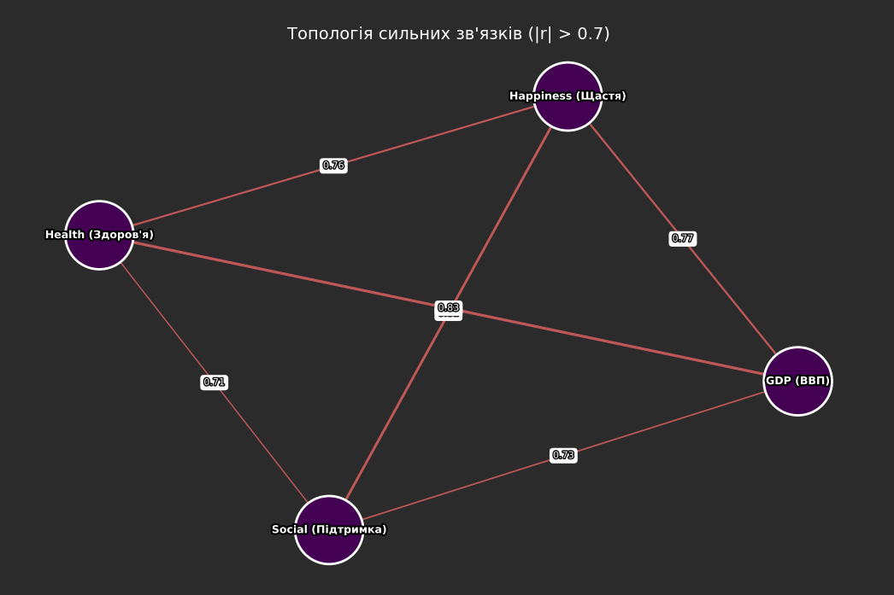
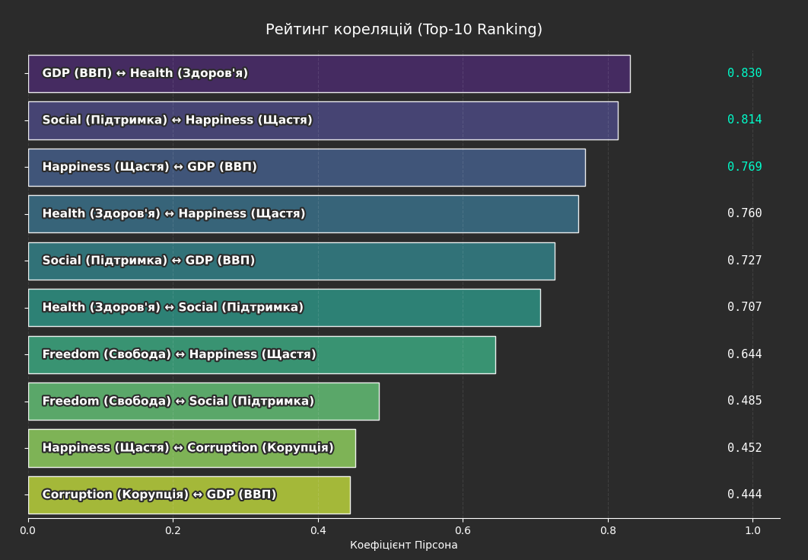
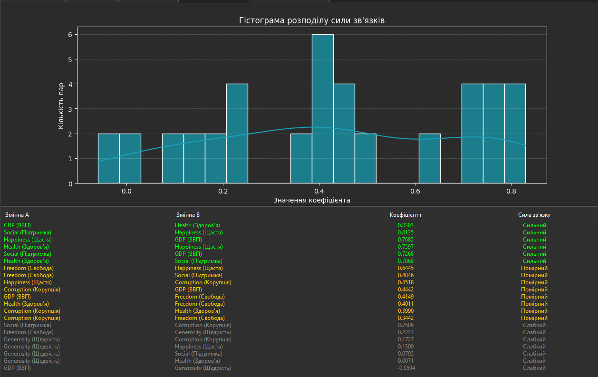
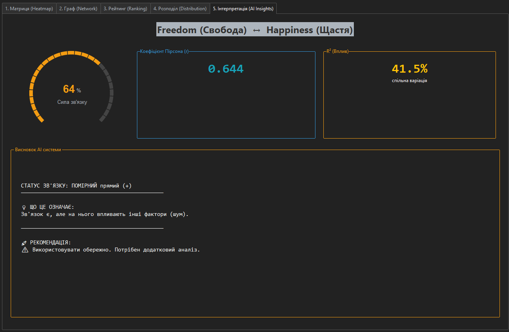

# 📊 Correlation Analysis System v5.2 (Academic Pro)

**Професійний інструмент для автоматизованого кореляційного аналізу даних, візуалізації топології зв'язків та інтерпретації результатів для бізнесу.**


## 📌 Про проект

Цей проект вирішує проблему **«інтерпретаційного розриву»** в аналітиці даних. Замість сухих статистичних таблиць, програма надає користувачеві наочні інсайти, дозволяючи миттєво зрозуміти структуру даних, виявити приховані закономірності та визначити ключові важелі впливу на бізнес-показники.

Розроблено як частину науково-дослідної роботи.

---

## 🔥 Ключові можливості

### 1. 🕸 Топологічний аналіз (Network Graph)
Використовує бібліотеку **NetworkX** для побудови графа сильних зв'язків.
- **Кластеризація:** Автоматично групує взаємозалежні змінні.
- **Центральність:** Розмір вузла залежить від кількості зв'язків.
- **Візуалізація сили:** Товщина та колір ліній відображають силу кореляції.

### 2. 🏆 Рейтинг впливу (Ranking Chart)
Автоматично будує **Топ-10** найсильніших кореляцій за принципом Парето.
- Допомагає бізнесу фокусуватися на головному.
- Професійний дизайн (текст всередині стовпчиків, адаптивна верстка).

### 3. 🤖 AI Insights (Автоматична інтерпретація)
Модуль "експертної системи", який перекладає цифри на людську мову.
- **KPI Dashboard:** Спідометр сили зв'язку, картки з $r$ та $R^2$.
- **Рекомендації:** Програма дає конкретні поради (наприклад, *"Можна використовувати для прогнозування"*).

### 4. 🧹 Smart Data Cleaning (Розумна очистка)
- Автоматичне видалення технічних колонок (*whisker, residual*).
- Розпізнавання кодувань (UTF-8, Latin-1) для старих Excel-файлів.
- Фільтрація нечислових даних.

---

## 📸 Огляд можливостей

### 1. Матриця кореляцій (Heatmap)
Класичний інструмент для загального огляду.
* **Особливості:** Автоматичне маскування дублікатів, чорний контрастний шрифт для читабельності, фільтрація "сміттєвих" колонок.


### 2. Топологія зв'язків (Network Graph)
Інноваційна візуалізація на базі бібліотеки **NetworkX**.
* **Особливості:** Вузли-хаби (чим більше зв'язків — тим більший розмір), кодування кольором, візуалізація сили зв'язку товщиною ліній.


### 3. Рейтинг впливу (Top Ranking)
Фокусування на головному за принципом Парето (20/80).
* **Особливості:** Показує лише Топ-10 найсильніших факторів. Назви змінних інтегровані в графік для економії місця (Table Lens design).


### 4. Статистичний розподіл (Distribution)
Детальний аналіз масиву даних.
* **Особливості:** Гістограма щільності кореляцій + "Розумний список" з кольоровим кодуванням сили зв'язку (Smart Table).


### 5. Інтерактивна інтерпретація (AI Insights)
Модуль, що перекладає математику на мову бізнесу.
* **Особливості:** Візуальний спідометр (KPI), розрахунок $R^2$ (коефіцієнт детермінації), автоматичні рекомендації ("Що це означає" та "Що робити").


---

## 🚀 Як запустити

### Вимоги
* Python 3.8+
* Встановлені бібліотеки (див. нижче)

### 1. Встановлення
Виконайте команду в терміналі:
```bash
pip install pandas numpy matplotlib seaborn networkx ttkbootstrap
````

### 2\. Запуск

```bash
python Python.py
```

-----

## 🛠 Технологічний стек

  * **Core:** Python 3.12
  * **GUI:** `Tkinter` + `ttkbootstrap` (Dark Theme)
  * **Data Engine:** `Pandas`, `NumPy`
  * **Visualization:** `Matplotlib`, `Seaborn`, `NetworkX`

-----

## 👨‍💻 Автор

**Литвиненко Дмитро** Студент 4-го курсу, "МНТУ"  
Спеціальність: Інженерія програмного забезпечення

